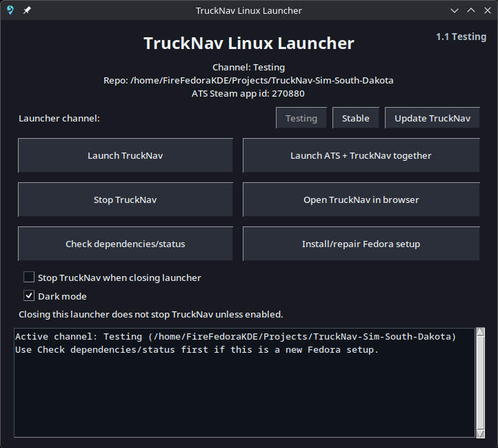

# TruckNav Linux

**TruckNav Linux** is my Fedora/Linux-focused fork of [TruckNav](https://github.com/Rares-Muntean/TruckNav-Sim), an external GPS/navigation app for **American Truck Simulator** and **Euro Truck Simulator 2**.

The goal is to keep TruckNav easy to run on Linux, easy to update, and able to rebuild current map data when SCS updates the games.

<!--
<p align="center">
  
</p>
-->

## Status

- **Primary platform:** Fedora Linux / KDE
- **Primary game:** American Truck Simulator through Steam + Proton
- **ATS maps:** generated locally from installed game files
- **Current ATS coverage:** South Dakota and the currently supported released DLC set
- **ETS2:** upstream support remains in the app, but the Linux launcher/map pipeline is not finished or tested yet
- **Map mods:** not currently supported

Fork versioning is tracked in [`VERSION`](VERSION).

## Features

- Native **TruckNav Linux Launcher**
- **Stable / Testing** channels
- One-click TruckNav updates
- One-click ATS map rebuilds
- ATS Steam-build vs. map-build tracking
- Live telemetry through the TruckNav server for local/LAN browsers
- Shared TruckNav settings across browsers
- Current ATS routing and visual map generation
- South Dakota support
- North-up follow mode that preserves manual rotation
- Intermediate route stops with distance + ETA alongside total trip stats

## Fedora setup

```bash
sudo dnf install -y nodejs npm git protontricks kde-cli-tools konsole python3 python3-tkinter curl procps-ng

git clone https://github.com/Firefoxray/TruckNav-Sim-Fire-Fedora.git
cd TruckNav-Sim-Fire-Fedora
bash scripts/install-fedora.sh
```

After setup, open **TruckNav Linux Launcher** from the KDE application menu.

## Launcher

- **Launch TruckNav** — starts TruckNav + telemetry without launching ATS.
- **Launch ATS + TruckNav together** — launches ATS if needed, then starts telemetry.
- **Stop TruckNav** — stops TruckNav and its telemetry helper.
- **Open TruckNav in browser** — opens the local web UI.
- **Update TruckNav** — updates the active Stable/Testing checkout without starting a game.
- **Check dependencies/status** — checks the Fedora/Linux setup.
- **Install/repair Fedora setup** — refreshes launcher and desktop integration.

If ATS is already running, TruckNav leaves it running.

## Map updates

TruckNav Linux compares the installed ATS Steam build with the build used for the current generated map. When they differ, the web control center can flag that a map update is available.

**Rebuild ATS Map** regenerates routing, visual tiles, sprites, cities, companies, and map metadata from the locally installed ATS files.

## Stable / Testing

```text
Stable  -> master
Testing -> development worktree / feature branch
```

When a tested feature is merged into `master`, switch the launcher back to **Stable**.

## LAN use

The same TruckNav instance can be opened from another computer, tablet, or phone. Shared settings are stored by the host, so normal TruckNav preferences stay consistent across browsers.

This personal fork currently allows shared administration for clients that can reach the TruckNav instance. If it is ever exposed to an untrusted/public network, disable shared administration until authentication is added:

```bash
TRUCKNAV_SHARED_ADMIN=0
```

## Development notes

- [`docs/TRUCKNAV_LINUX.md`](docs/TRUCKNAV_LINUX.md)
- [`docs/ATS_MAP_BUILD.md`](docs/ATS_MAP_BUILD.md)

TruckNav Linux is a personal Linux-focused fork and is not presented as the official upstream TruckNav release. ATS, ETS2, and SCS Software are separate from this project.

License: [`LICENSE`](LICENSE)

---

**Original project:** [Rares-Muntean/TruckNav-Sim](https://github.com/Rares-Muntean/TruckNav-Sim)  
**Thanks & acknowledgements:** [THANKS.md](THANKS.md)
